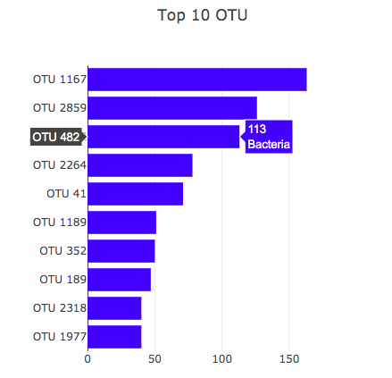

# Plot.ly Homework - Belly Button Biodiversity

Built an interactive dashboard to explore the [Belly Button Biodiversity DataSet](https://monalipatel.github.io/Interactive-Visualizations-and-Dashboards).

## Step 1 - Plotly.js

Used Plotly.js to build interactive charts for  dashboard.

* Create a PIE chart that uses data from your samples route (`/samples/<sample>`) to display the top 10 samples.

  * Used `sample_values` as the values for the Bar chart

  * Used `otu_ids` as the labels for the Bar chart

  * Used `otu_labels` as the hovertext for the chart

  

* Created a Bubble Chart that uses data from samples route (`/samples/<sample>`) to display each sample.

  * Used `otu_ids` for the x values

  * Used `sample_values` for the y values

  * Used `sample_values` for the marker size

  * Used `otu_ids` for the marker colors

  * Used `otu_labels` for the text values

  

* Display the sample metadata from the route `/metadata/<sample>`

  * Display each key/value pair from the metadata JSON object somewhere on the page
  
  

* Update all of the plots any time that a new sample is selected.

* An example dashboard page might look something like the following.

 

